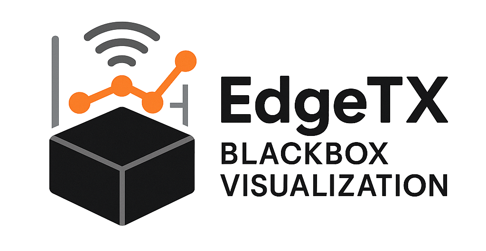

# EdgeTX Blackbox Visualization

> ⚠️ Work In Progress ⚠️
>
> This project is in its early stages and not fully functional yet

EdgeTX Blackbox Visualization is a tool for visualizing blackbox logs from EdgeTX firmware. It is designed to help users analyze flight data and improve their flying experience.

Main features:

- [ ] Statistics
  - [ ] Derivatives to fine-tune model
- [ ] Visualize blackbox logs from EdgeTX firmware
  - [ ] Draw a flight path
  - [ ] Graph flight data
- [ ] Convert logs to GPX format
- [ ] Convert logs to KML format
